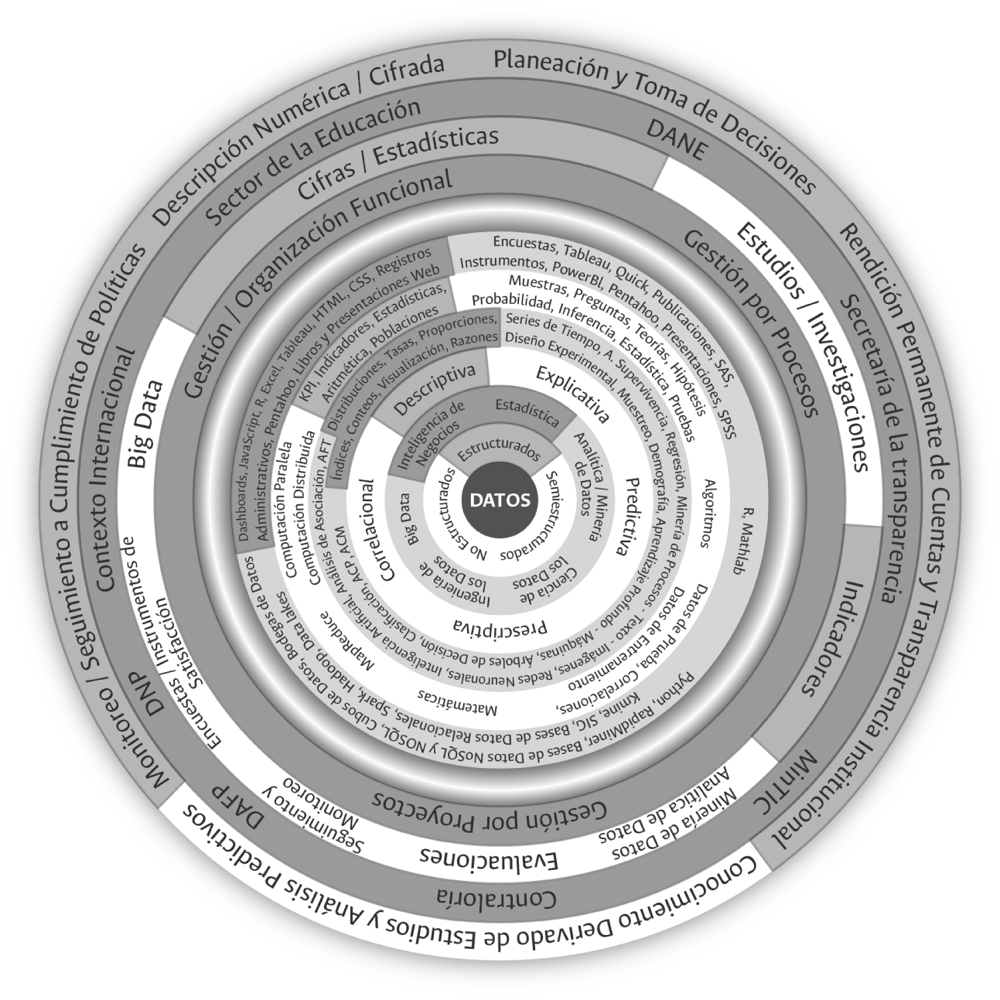

# **¿Qué y cómo medir?**

Las posibilidades existentes y alcanzables a través de la gestión de los datos en las universidades son tan numerosas que es fundamental priorizar y establecer una gestión que maximice las necesidades cuantitativas institucionales y del país a un costo financiero, humano, administrativo, académico y técnico razonable. Para ello se propone un enfoque minimalista. El minimalismo, en términos generales, hace referencia a la tendencia de volver a lo esencial, reducir una expresión a lo básico, eliminando aspectos sobrantes o accesorios. Esta es una corriente que inicia en el ámbito artístico y ha sido adoptada para diferentes usos, como obras de arte y decoración de ambientes. En este documento proponemos enfrentar, en un primer paso, la sobreinformación con minimalismo para una gestión de la información más efectiva a sus propósitos.

Es posible y deseable adelantar apuestas de _Big Data_ en las universidades, así como apuestas de minería o analítica de datos y estudios cuantitativos con propósitos causales o evaluaciones profundas a políticas institucionales, aunque académica, metodológica, operativa y financieramente resulta costoso. Cada vez existen más lineamientos y presiones a nivel estatal para ir en esta dirección, sin embargo, lo que actualmente más se le demanda a las universidades en Colombia es la carga de microdatos para sistemas de información externos, y la construcción y disposición de cifras estadísticas e indicadores institucionales.

Haciendo uso de los diferentes niveles que acompañan actualmente la gestión de la información cuantitativa en las universidades^[Los niveles se expusieron de manera detallada en el capítulo anterior y se ilustraron en la figura \@ref(fig:fig15).], la tabla 2 presenta el resultado de priorización –apuesta minimalista– que ha emprendido la Universidad Nacional de Colombia para enfrentar el contexto actual de demanda de información cuantitativa que se experimenta a nivel interno, el cual hace uso del acercamiento más simple a los datos –descriptivo–, responde a la mayoría de las exigencias internas y externas en materia de gestión y disposición de las cifras institucionales, y aprovecha aquellas herramientas tecnológicas de alta calidad y accesibles para cualquier universidad pública dados sus bajos costos.

**Tabla 2.** *Actividades priorizadas en materia de gestión estadística en la Universidad Nacional de Colombia*

|                                                               |                                                                                                                                        **Preguntas  orientadoras**                                                                                                                                       |                                                                                                                                                                                                                                                                                                                                                                                                                                                                                                                                              **Respuesta. Prioridad en la  Universidad Nacional de Colombia  – Apuesta minimalista**                                                                                                                                                                                                                                                                                                                                                                                                                                                                                                                                             |
|---------------------------------------------------------------|:----------------------------------------------------------------------------------------------------------------------------------------------------------------------------------------------------------------------------------------------------------------------------------------------------:|:----------------------------------------------------------------------------------------------------------------------------------------------------------------------------------------------------------------------------------------------------------------------------------------------------------------------------------------------------------------------------------------------------------------------------------------------------------------------------------------------------------------------------------------------------------------------------------------------------------------------------------------------------------------------------------------------------------------------------------------------------------------------------------------------------------------------------------------------------------------------------------------------------------------------------------------------------------------------------------------------------------------------------------------------------------------------------------------------------------------------------------------------------------------------------:|
| **Contexto de las cifras  en la universidad estatal  colombiana** | **Nivel 1.1** ¿Por qué y para qué  son útiles las cifras cuantitativas  en el escenario de la universidad  estatal contemporánea?                                                                                                                                                                        | Gestionar y disponer el legado histórico  y numérico de esta universidad, contar con más y mejor información para la planeación  y la toma de decisiones institucionales, mejorar los niveles de monitoreo y seguimiento  a políticas institucionales y aumentar los niveles  de transparencia institucional a través de un ejercicio  de rendición cuantitativa de cuentas de manera permanente.                                                                                                                                                                                                                                                                                                                                                                                                                                                                                                                                                                                                                                                                                                                                                                            |
|                                                               | **Nivel 1.2** ¿Qué normas o lineamientos  existen a nivel nacional e internacional  para orientar la construcción y disposición de cifras en el contexto de las entidades públicas y,  en especial, en las universidades? y  ¿cuál es el alcance a nivel institucional  de dichas normas y lineamientos? | Conocer y aplicar, en el contexto de las posibilidades, los lineamientos expedidos  en materia de gestión de información cuantitativa por parte de entidades nacionales como: <br/> **Sector de la educación y CTI:**  <br/> MEN (CESU-CNA, Conaces, SNIES, Spadies, OLE), Colciencias y OCyT. <br/> DANE: Plan Estadístico Nacional y NTCPE 1000. <br/> DNP: *Guía metodológica para el seguimiento  y la evaluación a políticas públicas.* <br/> DAFP: MIPG, *Manual Único de rendición de cuentas*, guía(s) para la construcción de indicadores. <br/> MinTIC: Gobierno Digital, datos abiertos. Secretaría de la Transparencia: Ley de  transparencia. <br/> Contraloría: MECI, Sireci. <br/> Contexto internacional: ONU, OCDE, Unesco, Eurostat, Cepal, Manuales internacionales  (Frascati, Oslo).                                                                                                                                                                                                                                                                                                                                                                                                                           |
|                                                               | **Nivel 1.3** ¿Cuál es el uso y alcance que se dará a los datos  disponibles a nivel institucional?                                                                                                                                                                                                      | Disponer de las cifras y los indicadores que se le demandan a la Universidad. Las principales demandas internas y externas que vive la universidad pública actual en Colombia y como consecuencia, las que más se gestionan en su interior son: estadísticas oficiales, indicadores de gestión, indicadores de desempeño, indicadores de eficiencia, indicadores de eficacia, indicadores de efectividad, indicadores de rentabilidad pública, indicadores de procesos, indicadores de proyectos, indicadores de planes de desarrollo, indicadores de calidad, indicadores de productos, indicadores de resultados, indicadores de impacto, indicadores ambientales, indicadores de economía, datos públicos, datos abiertos, cifras agregadas de aspirantes, estudiantes admitidos, estudiantes matriculados, graduados, docentes, funcionarios administrativos, investigadores, grupos de investigación, productos de investigación (publicaciones, patentes, citaciones, etc.), programas académicos, movilidad entrante y saliente a nivel nacional e internacional de docentes y estudiantes, cobertura en programas de bienestar universitario y capacidad financiera. |
|                                                               | **Nivel 1.4** ¿Qué modelo o cuáles modelos  organizacionales orientarán la gestión  de los datos disponibles?                                                                                                                                                                                            | Responder a las necesidades derivadas de la gestión por procesos,  la gestión funcional y la gestión por proyectos existentes  en la Universidad.                                                                                                                                                                                                                                                                                                                                                                                                                                                                                                                                                                                                                                                                                                                                                                                                                                                                                                                                                                                                                            |
| **Contexto académico y técnico de los datos**                     | **Nivel 2.1** ¿Qué tipos de datos existen a nivel institucional y cuáles vamos a gestionar?                                                                                                                                                                                                              | Aprovechar la existencia y disposición de datos de tipo estructurado.                                                                                                                                                                                                                                                                                                                                                                                                                                                                                                                                                                                                                                                                                                                                                                                                                                                                                                                                                                                                                                                                                                        |
|                                                               | **Nivel 2.2** ¿Bajo qué disciplina o tendencia serán analizados los datos?                                                                                                                                                                                                                               | Utilizar recursos heredados de la estadística y la inteligencia de negocios.                                                                                                                                                                                                                                                                                                                                                                                                                                                                                                                                                                                                                                                                                                                                                                                                                                                                                                                                                                                                                                                                                                 |
|                                                               | **Nivel 2.3** ¿Qué queremos responder y qué uso, en términos de análisis, haremos de los datos disponibles a nivel institucional?                                                                                                                                                                        | Aproximarnos de manera descriptiva a los datos estructurados disponibles.                                                                                                                                                                                                                                                                                                                                                                                                                                                                                                                                                                                                                                                                                                                                                                                                                                                                                                                                                                                                                                                                                                    |
|                                                               | **Nivel 2.4** ¿Qué método o técnica emplearemos para dar respuesta a las preguntas de interés institucional?                                                                                                                                                                                             | Hacer uso de conteos, proporciones, visualización, razones, índices, tasas, distribuciones.                                                                                                                                                                                                                                                                                                                                                                                                                                                                                                                                                                                                                                                                                                                                                                                                                                                                                                                                                                                                                                                                                  |
|                                                               | **Nivel 2.5** ¿Cuáles fundamentos o bases teóricas soportan los métodos o las técnicas cuantitativas empleadas a nivel institucional?                                                                                                                                                                    | Construcción y disposición, a partir de información poblacional, de estadísticas, indicadores, KPI, teniendo como base las enseñanzas de la aritmética.                                                                                                                                                                                                                                                                                                                                                                                                                                                                                                                                                                                                                                                                                                                                                                                                                                                                                                                                                                                                                      |
|                                                               | **Nivel 2.6** ¿Cuáles herramientas tecnológicas se requieren para la gestión de los datos disponibles a nivel institucional?                                                                                                                                                                             | Hacer uso de herramientas tecnológicas como Excel, R, HTLM, JavaScript, CSS y disponer la información a través de *dashboards*, presentaciones web, libros web y boletines digitales.                                                                                                                                                                                                                                                                                                                                                                                                                                                                                                                                                                                                                                                                                                                                                                                                                                                                                                                                                                                          |

El ejercicio de priorización que ha emprendido la Universidad Nacional en el contexto de la gestión de los datos institucionales disponibles a nivel administrativo, que se sintetiza en la figura \@ref(fig:fig16), es una de las probables rutas que pudiera haberse emprendido en materia de gestión estadística. No obstante, esta aproximación da respuesta a la mayoría de las necesidades internas y externas que experimenta esta institución en la actualidad a unos costos institucionales razonables.

```{r fig16, fig.align='center', out.width='75%', fig.show='hold', fig.cap='Alcance de la gestión estadística actual en la Universidad Nacional de Colombia en el contexto contemporáneo de los datos. Fuente: elaboración propia.',echo=FALSE}

```

En el contexto contemporáneo de los datos cuantitativos son de gran utilidad tanto las aproximaciones descriptivas como aquellas que hacen uso de técnicas e instrumentos sofisticados; sin embargo, la cultura estadística en las entidades que conforman el Estado será difícil de alcanzar si se inicia con la aplicación del procedimiento más complejo; no se escala una montaña iniciando por su cima. La cultura estadística en la Universidad Nacional de Colombia y en otras universidades y entidades es posible de alcanzar si se inicia por lo esencial y, de manera reflexiva, se avanza hacia lo complejo.

## **Diferencia entre estadísticas e indicadores**

La aproximación descriptiva de los datos disponibles en las universidades públicas, en la que nos concentraremos en lo que resta del presenta capítulo, está atravesada por dos acepciones de uso frecuente tanto en la cotidianidad de la gestión estadística a nivel de las universidades como en la normatividad y los lineamientos metodológicos expedidos por entidades nacionales e internacionales en lo referente a la materia: las cifras estadísticas (o estadísticas) y los indicadores. Hoy el lenguaje dominante en el escenario de lo público es el de los indicadores; no obstante, ayer era el de las estadísticas. No nos concentraremos en los antecedentes históricos sobre el origen y posicionamiento de estas acepciones y sobre las diferentes tipologías que las acompañan. Consideramos pertinente, por el momento, hacer una separación entre estos dos términos y, en especial, destacar la importancia de las estadísticas dada su cercanía, desde el nombre mismo, con la intención de cuantificar la realidad de un Estado y sus instituciones.

Las estadísticas y los indicadores de cumplimiento, como se ilustra en la figura \@ref(fig:fig17), se diferencian y complementan según el momento o la intención temporal en la que estos tienen sentido y pueden ser empleados. A través de las estadísticas nos es posible conocer la realidad descriptiva actual e histórica de un Estado y sus instituciones, mientras que a través de los indicadores de cumplimiento nos es posible monitorear el desarrollo de las metas y apuestas implementadas a través de planes, programas y proyectos liderados por los gobiernos de turno. Por medio de las estadísticas se cuantifica mientras que por medio de los indicadores se mide.

```{r fig17, fig.align='center', out.width='75%', fig.show='hold', fig.cap='Contexto de las estadísticas y los indicadores a lo largo del tiempo. Fuente: elaboración propia.',echo=FALSE}
knitr::include_graphics('imagenes/F_17.png')
```

## **Once características asociadas a las estadísticas**^[Esta caracterización de los rasgos que constituyen las estadísticas institucionales se soporta en la experiencia, los aportes y los lineamientos propios de la Universidad Nacional de Colombia. Más que una definición formal y de alcance global, se propone para ser analizada, adaptada, discutida y mejorada cuando así se considere en otras universidades y entidades públicas.]

Las estadísticas son cifras descriptivas de interés social e institucional que se caracterizan, en el ámbito de lo público y, dentro de este, en el contexto universitario, principalmente por: 

1. Ser construidas a partir de información poblacional o muestral obtenida de censos, registros administrativos o encuestas probabilísticas o no probabilísticas.
2. Estar conformadas por cifras agregadas de naturaleza descriptiva derivadas de conteos o de mediciones.
3. Caracterizar/desagregar temporal, temática y geográficamente rasgos de los individuos que conforman las poblaciones o muestras de interés.
4. Representar el presente y el pasado a través de la disposición de series de tiempo.
5. Tener la capacidad de reconocer y representar el comportamiento de grupos poblacionales minoritarios (incluyentes / inclusivas).
6. Ser susceptibles de ser representadas de manera tabular y gráfica (visualización).
7. Estar orientadas y delimitadas por normas y hacer uso de conceptos, estándares, clasificaciones y nomenclaturas internacionales, nacionales e institucionales que favorezcan su interpretación y comparación.
8. Estar disponibles a través de múltiples mecanismos de difusión y comunicación que permitan una adecuada interacción con los usuarios.
9. Hacer un uso intensivo de las nuevas tecnologías de la información y las comunicaciones.
10. Ser construidas a través de un proceso estadístico.
11. A partir de la comparación entre e intra poblaciones o muestras, aportar a la creación de nuevas estadísticas e indicadores institucionales y extrainstitucionales.