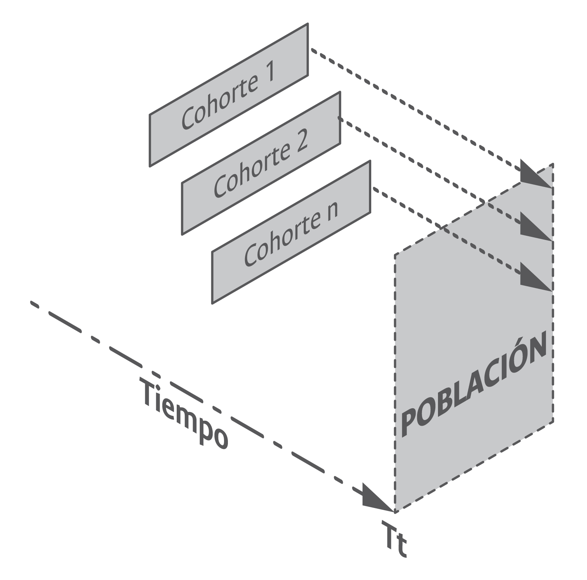

# ***Construidas a partir de información poblacional o muestral***

La *primera característica* de las estadísticas en el contexto de la universidad pública es que estas se extraen y soportan a partir de información disponible en poblaciones o muestras existentes a nivel institucional.

***Poblaciones***

Es el tipo de información más frecuente de encontrar en el ámbito de la universidad pública para efectos de la construcción y consolidación de estadísticas institucionales. Según @everitt2006cambridge, el término población se usa para identificar la colección de unidades finitas e infinitas^[En el contexto de la universidad pública es improbable encontrar ejemplos asociados a estadísticas derivadas de poblaciones infinitas, por lo que este documento, en adelante, cuando haga referencia al término población, asume que esta es finita, es decir, se conoce el número de individuos que conforman dichas poblaciones.] que corresponde muchas veces a personas pero que pueden ser también instituciones, eventos u otros. Las poblaciones de aspirantes a pregrado y posgrado, de estudiantes matriculados, de graduados, de revistas institucionales, de docentes de carrera, de funcionarios administrativos de carrera, etc., son ejemplos tangibles de poblaciones existentes en el contexto universitario las cuales, de hecho, soportan la construcción de estadísticas en la Universidad Nacional de Colombia dado el interés institucional existente por conocer el comportamiento global de ciertos aspectos comunes que comparten los individuos que las conforman^[Los individuos que conforman una población, como su nombre probablemente lo sugiere, no se reducen a personas u otros seres vivos, sino que estos, en el ámbito de las poblaciones existentes al interior de las universidades públicas, incluyen también aquellos que se ubican fuera del contexto biológico. Revistas científicas, artículos, patentes, universidades con las que se tienen firmados convenios de doble titulación, empresas vinculadas a través de servicios de extensión, etc., son algunos ejemplos de poblaciones en donde claramente los individuos que las conforman no son seres vivos.]. Por ejemplo, es de interés institucional y social el conocimiento de la evolución histórica del total de aspirantes a cursar estudios de pregrado en la universidad, o ciertas características de estos como la edad, el sexo, la nacionalidad, el lugar de nacimiento, el estrato socioeconómico, entre otros. 

Las características que comparten los miembros de una población de interés institucional son capturadas a través de lo que técnica y científicamente se conocen como *variables*. Desde una perspectiva estadística, las variables^[En un sentido coloquial una variable, como su nombre lo indica, hace referencia a algo que varía entre los individuos de una población o que puede estar sujeta a cambios. Por ejemplo, la edad es una variable asociada a poblaciones como los estudiantes, los aspirantes, los docentes, los graduados que, desde luego, varía entre los diferentes individuos que conforman dichas poblaciones.] asociadas a una población pueden ser clasificadas en: nominales, ordinales, de intervalo y de razón^[Clasificación propuesta por @stevens1946theory en el artículo “On the theory of scales of measurement” de la revista _Science_.] . 

Las _variables nominales_^[También conocidas como variables categóricas.]  son aquellas que permiten identificar cualidades de los individuos bajo observación. Por ejemplo, las variables sexo, estado civil y facultad en la que se encuentra matriculado un estudiante hacen parte del mundo de las variables nominales, las cuales se identifican/etiquetan con números o códigos cuyo único propósito es poder asociar una cualidad observada en los individuos, no es una característica numérica de estos. Las _variables ordinales_, a diferencia de las nominales, tienen un orden establecido; el estrato socioeconómico de un estudiante y el máximo nivel de formación alcanzado por un docente, por ejemplo, hacen parte del mundo de las variables ordinales. Tener como máximo nivel de formación pregrado es menor que tener maestría y este, desde luego, es menor que tener estudios de doctorado. Las variables nominales y ordinales hacen uso de los números con propósitos de identificación de cualidades, no obstante, en estas últimas existe una relación de orden entre dichas cualidades. 

Las _variables de razón y de intervalo_ hacen uso de los números para representar características asociadas a los individuos que conforman una población o muestra de interés. La única diferencia existente entre estos dos tipos de variables es el cero absoluto. En las variables de razón el cero significa ausencia de un atributo de interés, mientras que en las de intervalo el cero no significa la ausencia de dicho atributo. El tiempo de vinculación de un docente de carrera en la universidad, y el puntaje obtenido por los estudiantes en una prueba de admisión son dos ejemplos de variables de razón, dado que el valor cero significa que hasta ahora se vincula un docente a la universidad o que se obtuvo un valor de cero en una prueba de admisión --la peor puntuación--. La temperatura en un día dado, en contraste, es el ejemplo clásico empleado para representar variables de intervalo puesto que el valor cero no significa ausencia de atributo; es decir que no exista temperatura.

El mundo de las variables nominales y ordinales, dado el uso que hacen de los números, conforma lo que popularmente se conoce como variables de tipo cualitativo^[El uso del término cualitativo en el contexto estadístico no debe confundirse con el uso de este término en el estudio de fenómenos sociales que hacen uso de técnicas y métodos de tipo cualitativo y, en especial, aquellas empleadas por disciplinas de las ciencias humanas y sociales.]. Por su parte, el escenario de las variables de razón y de intervalo, dada su naturaleza numérica asociada, conforman el mundo de las variables cuantitativas. Los métodos y las técnicas estadísticas y analíticas deben su origen y se justifican gracias a su poder para estudiar los diversos fenómenos de estos dos conjuntos de variables. Unos son los métodos estadísticos y de analítica de datos disponibles para el estudio de fenómenos, que incluyen variables cualitativas, y otros aquellos disponibles para el estudio de las variables cuantitativas. La construcción de estadísticas institucionales se soporta principalmente en la disposición y construcción de variables de tipo cualitativo.

+ *Tipos de poblaciones*

Las estadísticas asociadas a información de tipo poblacional pueden ser de naturaleza diversa de acuerdo con la forma como son obtenidas o consolidadas. En principio, y salvo contadas excepciones, estas pueden ser de tipo transversal, anidado o longitudinal.

Las *poblaciones de tipo transversal*, como se ilustra en la figura \@ref(fig:fig18), son aquellas obtenidas en un punto determinado del tiempo sin importar el momento en que los individuos que las conforman empezaron a ser parte de las mismas. Para el caso de las universidades, los momentos típicos de corte empleados para la obtención y consolidación de poblaciones con propósitos de construcción de estadísticas son los semestres y los años^[En otras áreas de interés social se requieren periodos más cortos para la consolidación de poblaciones con miras a la disposición de estadísticas. Por ejemplo, en el contexto económico colombiano actual algunas cifras de interés nacional, como el Índice de Precios al Consumidor (IPC) y las tasas de desempleo se calculan y disponen de manera mensual por parte del DANE y el Banco de la República, respectivamente.]. Por ejemplo, en la Universidad Nacional de Colombia, poblaciones como las de aspirantes a pregrado y posgrado, de admitidos a pregrado y posgrado, de estudiantes matriculados, de graduados, de estudiantes en movilidad internacional, de funcionarios administrativos, de docentes, etc., se obtienen semestralmente con el fin de consolidar las estadísticas institucionales asociadas a estas. Poblaciones relacionadas con la investigación, dado su comportamiento, se obtienen anualmente.

```{r fig18, fig.align='center', out.width='75%', fig.show='hold', fig.cap='Representación esquemática de una población de tipo transversal. Fuente: elaboración propia.',echo=FALSE}
knitr::include_graphics('imagenes/F_18.png')
```

Las _poblaciones de tipo anidado_ también se obtienen en un punto determinado del tiempo sin importar el momento en que los individuos que las conforman empezaron a ser parte de estas. No obstante, estas poblaciones a su vez están contenidas dentro de una población mayor (figura \@ref(fig:fig19)) de la cual y contra la cual se extrae información de interés para las estadísticas institucionales. Las poblaciones de estudiantes admitidos o de matriculados por primera vez son ejemplos típicos de poblaciones anidadas, pues estas se encuentran contenidas dentro de una población mayor que es la de aspirantes (para el caso de los admitidos) y la de matriculados (para el caso de los matriculados por primera vez). Las poblaciones anidadas, además de servir de base para la consolidación de estadísticas, favorecen la construcción de indicadores simples como el de cobertura de admitidos a pregrado y posgrado en las universidades públicas (proporción entre admitidos y aspirantes).

```{r fig19, fig.align='center', out.width='75%', fig.show='hold', fig.cap='Representación esquemática de una población de tipo anidado. Fuente: elaboración propia.',echo=FALSE}
knitr::include_graphics('imagenes/F_19.png')
```

Las _poblaciones de tipo longitudinal_ son aquellas obtenidas en un momento  del tiempo en las cuales, a diferencia de las poblaciones transversales y anidadas, sí importa el tiempo en que los diferentes individuos que las conforman empezaron a ser parte de estas. Aunque teóricamente el tiempo de ingreso a la población de estudio puede ser medido de manera precisa, para el caso de la información de las universidades es frecuente que este sea igual para un número elevado de individuos y conforma lo que metodológicamente se conoce como cohortes^[Aunque existe una amplia variedad de definiciones sobre el significado de cohorte, para propósitos de este documento las entendemos como un grupo de individuos que son objeto de estudio a lo largo del tiempo, y que se caracterizan porque se conoce el momento en el que estos empezaron a conformarlas, así como la evolución de sus respectivas características.]. Por ejemplo, la población conformada por la unión de las cohortes de estudiantes admitidos a pregrado durante varios periodos de tiempo, además de permitir la consolidación de estadísticas institucionales, es la base para la construcción y medición de indicadores complejos como las tasas de deserción universitaria en las cuales se ha demostrado que el tiempo juega un rol fundamental. En la figura \@ref(fig:fig20) se puede observar que la población ilustrada en un momento o periodo del tiempo, está conformada por los individuos que integran un número de diferentes cohortes de interés institucional.

```{r fig20, fig.align='center', out.width='75%', fig.show='hold', fig.cap='Representación esquemática de una población de tipo longitudinal. Fuente: elaboración propia.',echo=FALSE}

```

+ *Disposición de poblaciones*

En el escenario de la universidad actual existen dos mecanismos de conformación de poblaciones: los registros administrativos y los censos.

El Estado y sus instituciones, desde la misma conformación de las naciones modernas, han sido grandes acopiadores y usuarios de información estadística de alcance poblacional. La forma como esta es capturada y almacenada se materializa en la actualidad, según el DANE, a través del uso de los *registros administrativos*, entendidos como: “Toda información que las instituciones públicas o privadas recolectan, almacenan o administran de personas naturales o jurídicas, en el ejercicio de sus funciones o competencias”^[Artículo 1.3.1.1 del Decreto 1743 de 2016 del DANE.]. La información poblacional de estudiantes matriculados, de docentes y funcionarios, de grupos de investigación, de profesores visitantes, entre otros, que es obtenida con propósitos administrativos, que se gestiona al interior de las universidades a través de sistemas de información y que se encuentra disponible en bases de datos institucionales, es información poblacional obtenida a través del uso de registros administrativos.

Un segundo mecanismo de acceso a información poblacional son los *censos*^[Los censos son el método estadístico más antiguo empleado por la humanidad para la obtención de información cuantitativa, como lo demuestra su uso desde tiempos bíblicos, por ejemplo, Lucas 2:1 cita: “Y aconteció en aquellos días que salió un edicto de César Augusto, para que se hiciera un censo de todo el mundo habitado”. Otros ejemplos de apartados bíblicos en el que se hace alusión de manera directa o indirecta a información censal son: Números 1:2, Números 3:40, Jueces 21:9, Samuel 11:18, Samuel 13:15, Isaías 33:18, Samuel 24:4, etc., y hacia el año 2238 antes de la era cristiana en la China al mando del emperador Yao. Desde los inicios de la nueva era cristiana, pasando por la Edad Media, el Renacimiento y hasta la consolidación y conformación de las naciones actuales, los censos, en especial aquellos asociados a las poblaciones humanas, siguen siendo uno de los instrumentos empleados de manera regular para la obtención y consolidación de estadísticas nacionales y la construcción de información clave para la disposición y medición de indicadores sectoriales e institucionales.] . A través de esta metodología se observa a cada miembro de una población con el fin de extraer de ellos información de interés de un conjunto de variables para su posterior análisis e interpretación. 

Los censos, de amplio uso en el ámbito nacional, son poco frecuentes en el contexto de las instituciones públicas para la conformación de poblaciones con miras a la consolidación de estadísticas institucionales. El poco uso de este mecanismo de obtención de información poblacional en el ámbito de las universidades se debe en especial a la buena disposición de datos a través del uso de registros administrativos la cual, además de implicar bajos costos y despliegues administrativos, se encuentra disponible de manera periódica, lo que no ocurre con los censos.

***Muestras***

La construcción y consolidación de estadísticas de alcance poblacional es el fin buscado en el ámbito de lo público. Esta información se obtiene a través del uso de registros administrativos o de censos cuando las circunstancias lo permiten (objetivos globales, poblaciones relativamente pequeñas y fácilmente identificables, recursos suficientes, etc.) (@sarndal2003model; @soto1996fundamentos). No obstante, en ocasiones se requiere cierta información y, por diversas razones, no es factible acceder a todos los individuos que conforman las poblaciones. Para estos casos, el mecanismo de obtención de información tradicionalmente empleado son las muestras^[Las muestras, al igual que las poblaciones, pueden ser clasificadas según su naturaleza en transversales, anidadas y longitudinales.]. 

Una muestra está conformada por un subconjunto de individuos de una población, los cuales pueden o no ser seleccionados a través de un mecanismo probabilístico. En las muestras, al igual que en las poblaciones, los individuos comparten características comunes sobre las que se está interesado en obtener estadísticas poblacionales de interés nacional, sectorial o institucional haciendo uso para ello de estimaciones inferidas a partir de los comportamientos observados en los individuos que las conforman. Una _muestra probabilística_^[El muestreo probabilístico o estadístico conforma un área de estudio de la disciplina estadística contemporánea, el cual cuenta con importantes desarrollos teóricos y metodológicos, así como una alta popularidad y uso en el contexto de la práctica estadística moderna, gracias a la precisión alcanzada.], según @levy2013sampling, es aquella en donde los individuos que la conforman fueron seleccionados a través de un procedimiento en el cual cada uno de aquellos que conformaban la población finita de origen tenía una probabilidad conocida (no necesariamente igual) de ser seleccionados. En caso contrario, *la muestra es no probabilística*. 

Un ejemplo del uso de muestras para la consolidación de estadísticas institucionales en el contexto de la educación superior son los llamados indicadores de opinión requeridos por el CNA en el marco de las autoevaluaciones con fines de acreditaciones de alta calidad. Los indicadores de opinión hacen referencia principalmente a la apreciación de estudiantes, egresados y docentes sobre aspectos académicos y administrativos del quehacer de las instituciones y sus programas académicos para los cuales, en la mayoría de los casos, no se cuenta con información poblacional accesible a través de registros administrativos y, por consiguiente, es común que se acceda a la misma a través del uso de muestras que regularmente son conformadas y construidas a través del uso de estrategias no probabilísticas, a pesar de la disposición de marcos poblacionales institucionales.
