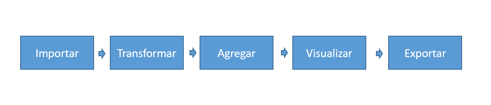

# ***Proceso Estadístico***

Este componente/capítulo presenta los pasos que se deben cumplir en el ejercicio de producción de estadísticas en la Universidad Nacional de Colombia. Este, en principio, debe cumplir con las siguientes fases o pasos metodológicos: ***usuarios, requisitos de las estadísticas, características de los registros administrativos, procesamiento de las estadísticas, comunicación de resultados y cultura estadística***.

## Usuarios

Para garantizar el éxito en el ejercicio de construcción y disposición de las estadísticas oficiales en la Universidad, en primer lugar, se debe garantizar un adecuado conocimiento y acercamiento a los usuarios y/o partes interesadas de cada una de las estadísticas disponibles a nivel institucional. 

Para garantizar un adecuado conocimiento de los usuarios y las partes interesadas del proceso de producción de una estadística institucional, en principio y como mínimo, debemos implementar las siguientes acciones institucionales. Para una mayor información sobre el procedimiento de caracterización de los usuarios y partes interesadas, la Universidad dispone de la presentación titulada ["Caracterización de Usuarios y Partes Interesadas"](http://siga.unal.edu.co/images/Modulos/Ova/Caracterizacin-de-usuarios-y-partes-interesadas.pdf) (@siga2021) en el marco del Sistema Integrado de Gestión Académica, Administrativa y Ambiental - SIGA.

1. *Identificar la población a analizar*
2. *Definir el periodo de referencia para el análisis de la información*
3. *Identificar fuentes y mecanismos de información*
4. *Recopilar y consolidar la información*
5. *Actuar, divulgar y publicar la información*

## Requisitos 

La estadísticas oficiales de la Universidad Nacional de Colombia deben cumplir las siguientes 14 características. 

- ***Característica 1. Población o muestras***.

La *primera* característica de las estadísticas en el contexto de la universidad pública es que estas se extraen y soportan a partir de información disponible en poblaciones o muestras existentes a nivel institucional.

Las estadísticas asociadas a información de tipo poblacional pueden ser de naturaleza diversa de acuerdo con la forma como son obtenidas o consolidadas. En principio, y salvo contadas excepciones, estas pueden ser de tipo transversal, anidado o longitudinal.

Finalmente, las estadísticas asociadas a información de tipo poblacional son aquellas construidas a partir de muestras. Una muestra está conformada por un subconjunto de individuos de una población, los cuales pueden o no ser seleccionados a través de un mecanismo probabilístico. En las muestras, al igual que en las poblaciones, los individuos comparten características comunes sobre las que se está interesado en obtener estadísticas poblacionales de interés nacional, sectorial o institucional haciendo uso para ello de estimaciones inferidas a partir de los comportamientos observados en los individuos que las conforman. Una muestra probabilística

- ***Característica 2. Cifras agregadas***.

La *segunda* característica de las estadísticas está relacionada con la capacidad que estas tienen para representar la información de manera resumida o agregada. Las estadísticas no existen sin la disponibilidad de cifras descriptivas agregadas, producto de la actividad de contar o de medir, estas son su esencia. Las estadísticas se interesan por el descubrimiento de regularidades sociales, no es de su interés el estudio del comportamiento de rasgos individuales, aunque se valen de ellos para sus propósitos.

Las medidas agregadas asociadas a las estadísticas son aproximaciones de tipo descriptivo que pueden ser de dos tipos: conteos o mediciones.

1. *Conteos*: estadísticas derivadas de variables cualitativas
El primer tipo de cifras derivadas del proceso de construcción de estadísticas lo conforman aquellas cuyo resultado es el producto de contar los individuos que conforman una población o muestra, o que al interior de estas comparten ciertos rasgos o atributos de interés. 

2. *Mediciones*: estadísticas derivadas de variables cuantitativas
El segundo tipo de cifras asociadas a la construcción de estadísticas lo conforman aquellas que miden ciertos parámetros de interés poblacional asociados al comportamiento de los individuos en una o más variables de interés. Mientras que el primer tipo de cifras asociadas a las estadísticas se centra en contar, este tipo de cifras se centra en medir, por ejemplo, las medidas de tendencia central como el promedio, la mediana o la moda; de posición no central como los cuartiles, deciles, quintiles o percentiles; de dispersión como la varianza, la desviación estándar o el rango; de apuntamiento como la kurtosis, y de simetría o asimetría.

- ***Característica 3. Desagregaciones (temporales, temáticas y geográficas)***.

La *tercera* característica de las estadísticas es la capacidad de disponer y presentar información de manera desagregada. Las desagregaciones a través de las cuales se representa la información institucional, en el contexto de la universidad pública, son de tres tipos: temporales, geográficas/institucionales y temáticas.

1. *Temporales*:  hace referencia a la capacidad de las estadísticas para representar la información desde una perspectiva histórica. Implica la consolidación, el almacenamiento y la disposición de las poblaciones y muestras generadas a lo largo del tiempo. Los años, los semestres y, en una menor medida, los trimestres o meses son las variables comúnmente empleadas para la provisión de estadísticas desde una perspectiva temporal.

2. *Geográficas*: los individuos que conforman una muestra o población asociada a la construcción de estadísticas generalmente se encuentran distribuidos espacialmente dentro de un territorio o ubicados jerárquicamente dentro de una estructura organizacional. La capacidad de las estadísticas para representar la información desde una perspectiva geográfica o institucional es una de las características esenciales que favorecen el hacer y la toma de decisiones en el contexto de lo público.

3. *Temáticas*: las desagregaciones temáticas son características de los individuos que hacen parte de poblaciones o muestras las cuales trascienden el tiempo y la geografía y, al igual que estas, hacen parte constitutiva de las estadísticas. Por ejemplo, el sexo, el género, la edad, las condiciones socioeconómicas, la presencia de discapacidades, entre otras, hacen parte de los tipos de desagregaciones probables de ser tenidas en cuenta en las universidades para caracterizar las poblaciones humanas que hacen parte de sus comunidades.

- ***Característica 4. Representación tabular y gráfica***.

La *cuarta* característica de las estadísticas está relacionada con la capacidad que estas tienen para ser representadas de manera gráfica y tabular. La representación gráfica es el rostro de las cifras y es el principal instrumento de comunicación para transmitir el mensaje que deseamos a través de la disposición de las estadísticas en el contexto del Estado y desde luego en sus universidades.

- ***Característica 5. Comparables***.

La *quinta* característica de las estadísticas oficiales está relacionada con la capacidad de ser comparables a nivel institucional, sectorial, nacional e inticional. Para ello, estas debeb hacer uso de estándares nacionales e internacionales. Así mismo, deben disponer y hacer uso de codificaciones y de nomenclaturas en su proceso de construcción.

Por ejemplo, la División Política y Administrativa del País - DIVIPOLA, es un estándar disponible a nivel de país para la identificación de los departamentos y municipios existentes a lo largo de la geografía nacional.

- ***Característica 6. Múltiples mecanismos de difusión***.

La *sexta* característica de las estadísticas está relacionada con la estrategia de difusión y comunicación de las cifras disponibles a nivel institucional. Las estadísticas, en principio, podrán y deberán ser divulgadas a través de los siguientes mecanismos de difusión:

1. *Boletines o anuarios estadísticos*:
2. *Cubos de información (data cubos)*
3. *Dashboards*
4. *Presentaciones*
5. *Folletos o brochures*
6. *Redes sociales*

- ***Característica 7. Uso intensivo de las TIC***.

La *septimea* característica de las estadísticas está asociada con el uso intensivo que estas deben hacer, en la actualidad, de las TIC para su gestión. 

La captura, el almacenamiento, la transformación, la construcción, la visualización y comunicación de cifras estadísticas está mediada por el uso de herramientas de tipo tecnológico. Datos derivados de registros administrativos capturados en sistemas de información; información extraída a partir de consultas a estos sistemas en archivos planos o almacenada en bodegas de datos o data lakes; agregación de datos o transformación de los mismos a través del uso de software como Excel o especializados como R, SAS o Python; entrega de resultados a través de datacubos, dashboards o boletines impresos, en archivos pdf o documentos web; construcción de gráficos estáticos y dinámicos, con altos niveles de diseño y con capacidad de interactuar con los usuarios a través de ambientes web y, finalmente, comunicación de los resultados a través de instrumentos modernos como las redes sociales, como se ha mostrado a lo largo de este documento, hacen parte del lenguaje, la cotidianidad y las competencias actuales requeridas para la gestión de las estadísticas en el escenario de lo público y todos estos requisitos, en mayor medida, tienen que ver con el lenguaje que traen consigo las TIC.

- ***Característica 8. Incluyentes***.

La *octava* característica de las estadísticas está relacionada con la capacidad que este tipo de cifras tienen, en el ámbito de lo público, para representar a las poblaciones que hacen parte de la sociedad sin discriminaciones por razones de sexo, raza, origen, religión, opinión política, filosofía, etc.

- ***Característica 9. Legales y éticas***.

La *novena* característica de las estadísticas está relacionada con los aspectos legales y éticos que deben ser tenidos en cuenta al momento de su construcción. 

En primer lugar, estas deben tener en cuenta los aspectos legales, como por ejemplo, la [Ley de Protección de Datos Personales](https://www.funcionpublica.gov.co/eva/gestornormativo/norma.php?i=49981) o **Habeas Data**. 

En segundo lugar, estas deben ser construidas de manera ética en todo su proceso. En principio, se recomienda implementar los lienamientos definidos por el Departamento Nacional de Estadística DANE a través del [Sistema de Ética - SETE](https://www.sen.gov.co/files/sen/Documento%20Maestro%20SETE.pdf)(@SETE).

- ***Característica 10. Públicas y transparentes - abiertas***.

Las estadísticas oficiales, además de ser construidas respetando los marcos jurídicos existentes y los principios éticos emitidos por el ente rector del país (DANE) en materia de construcción y disposición de estadísticas oficiales, deben ser dispuestas de manera abierta y accesible para los usuarios de las mismas.

La *décima* carectarística de las estadísticas está relacionada con el principio de transparencia que debe existir en su proceso de construcción. Para ello, se deben tener en cuenta los lineamientos definidos en el marco de la [Ley de Transparencia y del Derecho de Acceso a la Información Pública Nacional](https://www.funcionpublica.gov.co/eva/gestornormativo/norma.php?i=56882) (Ley 1712 de 2014).

- ***Característica 11. Metadatos***.

La *onceava* característica de las estadísticas implica la disposición de metadados que faciliten su proceso de interpretación y eviten un mal uso de las mismas. Aunque no existe un marco estandarizado a nivel país para la disposición de metatados, se suigiere su construcción y disposición a nivel interno teniendo en cuenta, por ejemplo, la estructura de [metadatos](http://estadisticas.unal.edu.co/menu-principal/cifras-generales/metadatos/) definida en la [página de estadística](http://estadisticas.unal.edu.co/home/) de la Universidad.

- ***Característica 12. Proceso estadístico***.

La construcción y disposición de estadísticas institucionales requiere la ejecución sistemática y ordenada de un conjunto de actividades conducentes a la disposición de las cifras institucionales requeridas. La *doceava* característica de las estadísticas está relacionada con la necesaria existencia de un proceso estadístico sostenible que garantice la construcción y disposición de las estadísticas institucionales.

Un proceso estadístico se entiende como un “conjunto sistemático de actividades encaminadas a la producción de estadísticas que comprende, entre otras, la detección de necesidades, el diseño, la recolección, el procesamiento, el análisis y la difusión”. Este conjunto de actividades se debe acompañar a su vez de unos requisitos de calidad para la generación de estadísticas institucionales. Para que las estadísticas oficiales que producela Universidad sean consideradas oficiales, además de estar incluidas en el Plan Estadístico Nacional, deben haber aprobado la evaluación de la calidad estadística establecida por el Sistema Estadístico Nacional (SEN).

- ***Característica 13. Líneas de base - nuevas estadísticas***.

La *catorceava* y última característica asociada a las estadísticas está relacionada con la capacidad que estas ofrecen para la construcción y el soporte de nuevas estadísticas y, en especial, de sistemas o indicadores más complejos, así como de indicadores de cumplimiento o gestión institucional.

## Registros Administrativos

El proceso de construcción de estadísticas institucionales, una vez se han identificado los usuarios o partes interesadas, así como los requisistos que estas deben cumplir para ser consideradas como tal, consiste en la caracterisación de los registros administrativos.

De acuerdo con el [DANE](https://www.dane.gov.co/index.php/sistema-estadistico-nacional-sen/registros-administrativos/documentacion-registros-administrativos) (@Registros) y según el [Departamento Administrativio de la Función Pública](https://www.funcionpublica.gov.co/VisualSIE/faces/javax.faces.resource/docs/Documento_operaciones_estadisticas_y_registros_administrativos.pdf)(@RegistrosDAFP), ***un registro administrativo*** se  define como el conjunto de datos que contiene la información recogida y conservada por entidades u organizaciones en el cumplimiento de sus funciones o competencias misionales.

Por esta razón, los regisros admnistrativos constituyen una fuente importante para la generación de operaciones estadísticas, por la cantidad de variables que manejan y la información que contienen, pues pueden ser utilizados para investigaciones de diferente naturaleza social o económica. 

La caracterización de los registros administrativos que sirven de base para la construcción y disposición de estadísticas institucionales se da a través de la disposición de sus metadatos los cuales, en principio, deben contener los siguientes aspectos:

1. *Nombre del registro administrativo*
2. *Instancia responsable*
3. *Datos de contacto del o los responsables del registro administrativo*
4. *Objetivo del registro administrativo*
5. *Marco normativo incluído en el registro administrativo*
6. *Unidad de observación*
7. *Cobertura geográfica*
8. *Conceptos básicos*
9. *Uso de nomenclaturas y clasificaciones*
10. *variables del registro*
11. *Metodología para el acopio de los datos*
12. *Instructivos, manuales y/o guías para el desarrollo del registro*
13. *Control y calidad del registro*
14. *Almacenamiento del registro administrativo*
15. *Uso del registro administrativo*
16. *Accesibilidad*

## Procesamiento

El procesamiento de los registros administrativos con el fin de generar/disponer estadísticas institucionales, es una de las fases más importantes en el ejercicio de construcción de estadísticas. Este, a diferencia de los demás pasos definidos, implica un alto componente técnico y estadístico. En la figura que se presenta a continuación, se ilustran los grandes pasos que deden ser tenidos en cuenta al momento de procesar los datos con el objetivo de generar las estadísticas institucionales.

Los anteriores pasos implican, en el ámbito de la Universidad, implementar las siguientes acciones.

1. ***Importar***: consiste en definir el ***scrips*** o ***procedimiento*** de importación de los datos al software que será empleado para la construcción/consolidación de las estadísticas institucionales.

2. ***Transformar***: consiste en definir el ***scrips*** o ***procedimiento*** de transformación y/o depuración de los datos requeridos para la consolidación de los datos institucionales.

3. ***Agregar***: consiste en definir el ***scrips*** o ***procedimiento*** requerido para la agregación de las estadísticas institucionales. Como se ilustró/mencionó en el apartado de requisitos, una de las características centrales de las estadísticas institucionales en su capacidad de presentan cifras agregadas; es decir, consolidados a partir de los individuos que conforman un registro administrativo.

4. ***Visualizar/Tabular***: consiste en definir el ***scrips*** o ***procedimiento*** requerido para la visualización, tabulación y publicación de las cifras oficiales. Los gráficos requeridos para la visualización de la información estadística deben cumplir con las buenas prácticas requeridas para una correcta disposición de los mismos. En contraste, las tablas deben tener la posibilidad de ser dispuestas de manera web.

5. ***Exportar***: consiste en definir los scrips y/o herramientas tecnológicas requeridas para la disposición/exportación de las estadísticas oficiales. Estas, en la medida de las posibilidades, deben estar dispuestas en plataformas a nivel de *cloud*, en páginas web o en softwares especializados para la disposición de dashboards.

Finalmente, todos los pasos previamente descritos deben contener, de ser posible, los respectivos metadatos que permitan documentar las diferentes acciones implementadas de modo que estos sean fácilmente entendidos por cualquier actor con el dominio técnico requerido.

## Comunicación

La *sexta* característica de las estadísticas está relacionada con la estrategia de difusión y comunicación de las cifras disponibles a nivel institucional. Las estadísticas, en principio, podrán y deberán ser divulgadas a través de los siguientes mecanismos de difusión:

1. *Boletines o anuarios estadísticos*:
2. *Cubos de información (data cubos)*
3. *Dashboards*
4. *Presentaciones*
5. *Folletos o brochures*
6. *Redes sociales*

## Cultura

