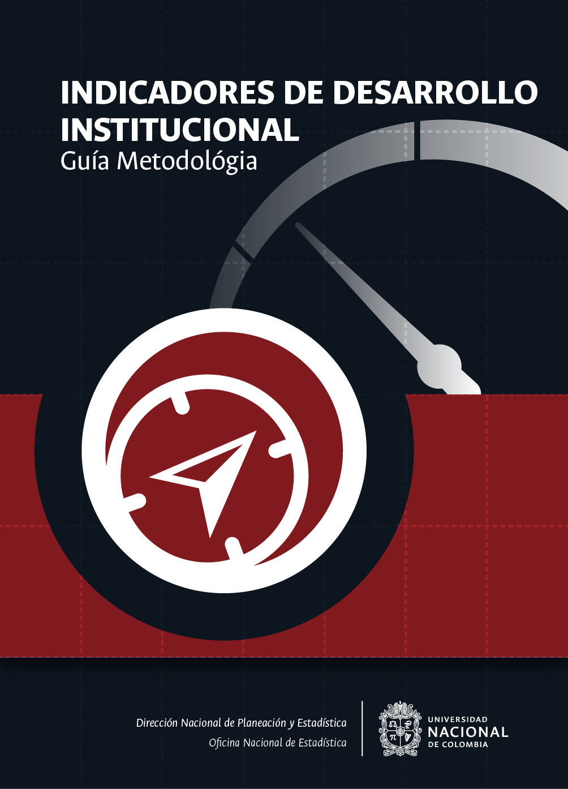

--- 
title: "Estadísticas Oficiales Institucionales"
subtitle: "Guía Metodológica"
author: ["Dirección Nacional de Planeación y Estadística <br> Oficina Nacional de Estadística"]
date: "`r Sys.Date()`"
site: bookdown::bookdown_site
documentclass: book
bibliography: [book.bib, packages.bib]
biblio-style: apalike
link-citations: yes
---

```{r setup, include=FALSE}
knitr::opts_chunk$set(echo = FALSE, message = FALSE, screenshot.opts = list(delay = 1, zoom = 0.75, vheight = 550, vwidth = 700), fig.pos = "H", out.extra = "" )
```


# Portada {-}

```{r fig.align='center', out.width='75%', fig.show='hold', echo=FALSE}

```